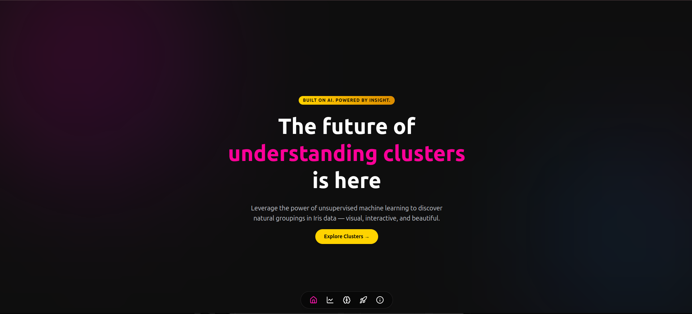
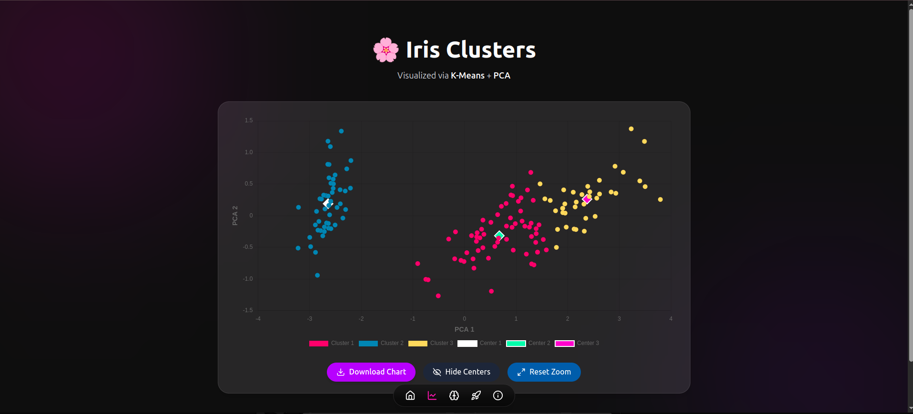
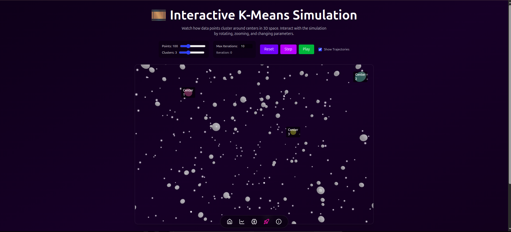

# 🔍 Iriscope

**Iriscope** is a beautifully crafted, interactive playground for exploring unsupervised learning — combining machine learning clarity with stunning frontend storytelling. Dive into clusters, simulations, and notebook-style explanations all in one elegant space.

---

## ✨ Features

- 📊 Visualize **K-Means clustering** on real datasets
- 🌐 Explore a **3D interactive simulation**
- ✍️ Notebook-style **About page** with typing animation
- 🧠 Font toggle for creative or technical reading modes
- 🎨 Elegant Web3-inspired UI with gradients & textures

---

## 🖼️ Previews

| Home Page              | Cluster Chart View        | 3D Interactive Simulation    |
|------------------------|---------------------------|------------------------------|
|  |  |  |

---

## 🚀 Technologies Used

- React + Vite ⚛️
- Three.js via `@react-three/fiber`
- Tailwind CSS + Framer Motion
- `react-type-animation` ✍️
- `@react-three/drei` (orbit controls, stars, etc.)

---

## 📦 Installation

```bash
# Clone the repository
git clone https://github.com/manjil-budhathoki/Iriscope.git

# Navigate into the folder
cd iriscope

# Install dependencies
npm install

# Run locally
npm run dev
```

---

## 🌍 Live Demo

> Will be available at: [https://iriscope.vercel.app](https://iriscope.vercel.app)

---

## 🤝 Contributing

We love collaboration — whether you're an ML nerd, a designer, or a writer. Fork the repo, open an issue, or just drop by to chat!

---

## 📝 License

MIT License © 2024 Manjil Budhathoki & Contributors

---

## 📫 Connect with Us

- GitHub: [@manjil-budhathoki](https://github.com/manjil-budhathoki)
- LinkedIn: [Manjil Budhathoki](https://linkedin.com/in/manjil-budhathoki)
- Twitter: [@manjilbudhathoki](https://twitter.com/manjilbudhathoki)

---
